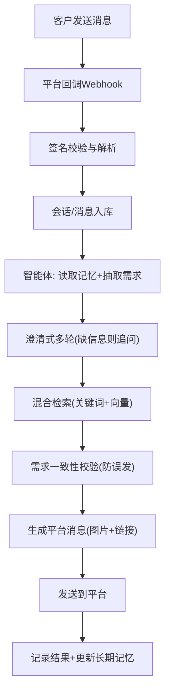
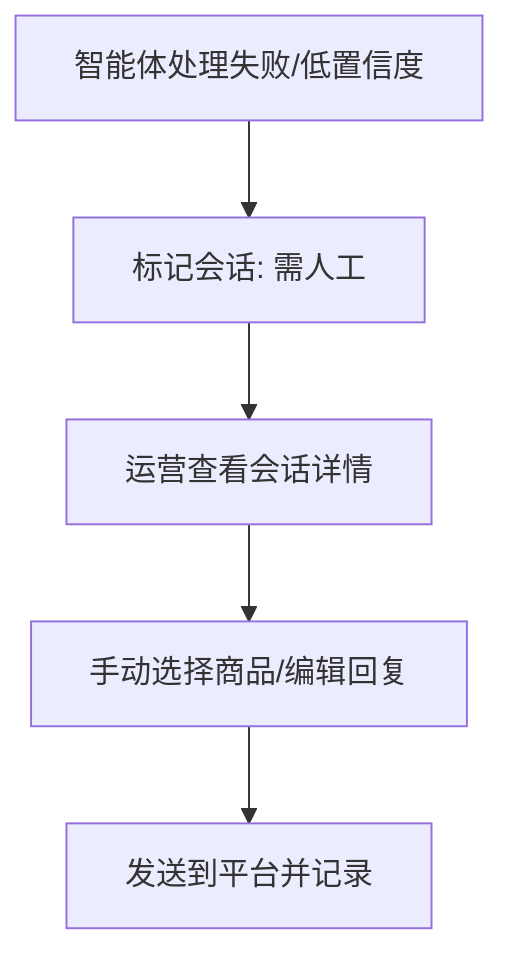

## 1. 产品概述
一个可接入钉钉、飞书、WhatsApp 等平台的智能客服/售卖智能体：统一接收客户消息，理解需求后从商品数据库检索匹配商品，并把图片与链接回发给客户；同时提供后台管理 UI 用于商品数据上传、更新与对话运营。

## 2. 核心功能
### 2.1 用户角色
| 角色 | 登录方式 | 核心权限 |
|------|----------|----------|
| 管理员/运营 | 账号密码（MVP）/单点登录（后续） | 商品管理、连接器配置、对话查看与处理、智能体策略配置 |

### 2.2 功能模块
1. **后台控制台**：商品管理、对话收件箱、连接器与系统设置
2. **消息接入层**：钉钉/飞书/WhatsApp 多平台适配，统一 webhook 入口
3. **智能体编排（LangGraph）**：澄清式多轮 → 混合检索（关键词+向量）→ 需求一致性校验 → 生成回复 → 发送消息（图片+链接）→ 人工接管
4. **商品数据层**：商品 CRUD、图片上传、链接管理、混合检索（关键词+向量）
5. **长期记忆**：记录用户偏好与对话摘要（永久保存），支持运营后台一键手动清除

### 2.3 页面详情
| 页面名称 | 模块名称 | 功能描述 |
|---------|----------|----------|
| 登录 | 登录表单 | 账号密码登录（MVP），支持退出登录 |
| 控制台概览 | 关键指标卡片 | 今日消息量、命中商品次数、人工接管次数、失败率 |
| 商品管理 | 商品列表 | 搜索/筛选、分页、上架状态、快速复制链接 |
| 商品管理 | 新建/编辑商品 | 标题、SKU、类目、价格（可选）、描述、标签、外链 URL、图片上传（多图） |
| 商品管理 | 批量导入/导出 | CSV 导入/导出（MVP 可选） |
| 对话收件箱 | 会话列表 | 按平台/状态筛选（自动/人工）、最近消息预览 |
| 对话收件箱 | 会话详情 | 消息时间轴、智能体命中结果、手动发送商品卡片/文本 |
| 设置 | 平台连接器 | 配置钉钉/飞书/WhatsApp 的 webhook、签名校验、回调 URL、发送权限检查 |
| 设置 | 智能体策略 | 触发规则、回复模板、兜底话术、人工接管规则 |
| 设置 | 模型与检索 | LLM/Embedding 配置（阿里云/豆包等接口模式，后续可切本地模型）、混合检索开关与阈值 |
| 记忆管理 | 用户记忆 | 查看用户偏好/摘要记忆、按用户一键清除（永久保存但可清除） |

## 3. 核心流程
### 3.1 客户咨询 → 自动推荐商品
1. 客户从某个平台发送消息
2. 平台回调到系统 webhook（按平台签名校验）
3. 系统创建/更新会话与消息记录
4. 智能体进入 LangGraph 编排：读取长期记忆 → 意图与实体抽取（关键词、规格、预算等）
5. 澄清式多轮：缺关键信息则提问补齐（A）
6. 混合检索：关键词检索 + 向量检索召回 TopN
7. 需求一致性校验：智能体判断候选商品是否满足需求，防止相似但不匹配的商品误发
8. 生成回复：将商品图片与链接组织为平台可发送的消息格式（卡片/图文/富文本）
9. 发送消息回平台；记录发送结果与失败原因，并更新用户长期记忆

### 3.2 人工接管（兜底）
1. 智能体置信度不足/检索不到商品/多次失败
2. 会话自动转入“需人工处理”
3. 运营在收件箱中查看上下文并手动发送商品或文本

## 4. 用户界面设计
### 4.1 设计风格
- 基调：深色控制台 + 高对比度高亮色（强调“运营台”效率感）
- 组件：卡片化信息架构、表格与侧栏组合布局，操作按钮集中在右侧工具区
- 字体：标题使用个性化展示字体，正文使用高可读性无衬线字体
- 动效：列表加载与过滤有轻量过渡；图片上传有进度与即时预览

### 4.2 页面设计概览
| 页面名称 | 模块名称 | UI 元素 |
|---------|----------|---------|
| 控制台概览 | 指标卡片 | 大数字、趋势箭头、平台分布小图 |
| 商品管理 | 表格+抽屉表单 | 表格列可配置、右侧抽屉编辑、图片网格预览 |
| 对话收件箱 | 双栏布局 | 左侧会话列表、右侧消息时间轴、智能体推荐区 |
| 设置 | 分组表单 | 平台卡片、连接状态提示、密钥脱敏显示 |

### 4.3 响应式
- 桌面优先；平板可用；移动端仅提供基础浏览与应急回复（后续增强）

## 5. 非功能需求
- 安全：平台签名校验、接口鉴权、敏感配置加密存储/脱敏展示
- 可观测：每条消息的处理链路日志与失败原因；基础指标统计
- 可扩展：平台连接器插件化；检索策略可替换（关键词/向量）

## 6. MVP 边界（建议）
- MVP 平台接入：优先实现飞书真实接入，其余以“连接器框架 + 模拟器/占位”交付
- MVP 智能体：LangGraph 有状态编排（澄清式对话 + 人工接管 + 长期记忆）；LLM 采用接口模式（阿里云/豆包等），后续可切本地模型
- MVP 商品：商品 CRUD + 多图上传 + 外链 URL + 标签 + 关键词检索 + 向量检索（小规模可先用内置向量索引实现）
