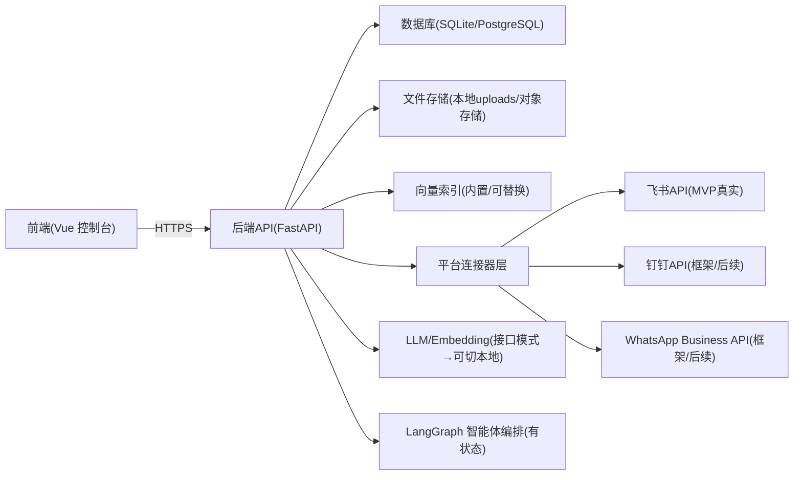
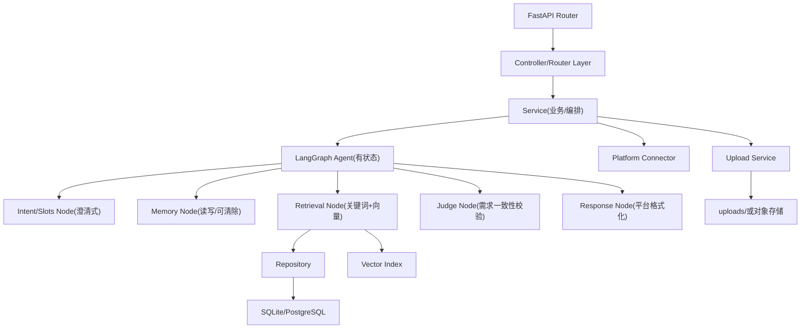
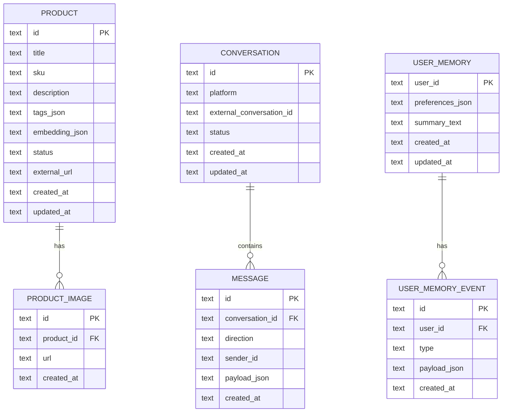

## 1. 架构设计


## 2. 技术说明
- 前端：Vue@3 + TypeScript + tailwindcss@3 + vite
- 后端：Python + FastAPI
- 智能体：LangChain + LangGraph（推荐用图编排保证可控与可解释）
- 数据库：SQLite（MVP），后续可平滑迁移 PostgreSQL
- 向量检索：MVP 采用“内置向量索引”（商品量小可用）；后续可替换为 pgvector/Qdrant/Milvus
- 文件存储：本地 uploads（MVP），后续可切换 OSS/S3
- 鉴权：后台控制台 JWT；平台 webhook 使用签名校验与白名单
- LLM/Embedding：采用接口模式（阿里云/豆包等），后续支持切换本地模型服务（同一抽象接口）
- 运行方式：前后端分离部署；前端通过环境变量配置后端 API 地址

## 3. 路由定义（前端）
| 路由 | 用途 |
|------|------|
| /login | 登录页 |
| /dashboard | 概览与指标 |
| /products | 商品列表 |
| /products/new | 新建商品 |
| /products/:id | 编辑商品（抽屉/页面） |
| /inbox | 对话收件箱 |
| /settings/connectors | 平台连接器设置 |
| /settings/agent | 智能体策略设置 |
| /memory | 记忆管理（查看/清除） |

## 4. API 定义（后端）
### 4.1 鉴权
- POST /api/auth/login
  - req: { username: string; password: string }
  - res: { token: string }

### 4.2 商品
- GET /api/products?query=&status=&page=&pageSize=
  - res: { items: Product[]; total: number }
- POST /api/products
  - req: ProductCreate
  - res: Product
- PUT /api/products/:id
  - req: ProductUpdate
  - res: Product
- POST /api/products/:id/images
  - multipart/form-data: files[]
  - res: { images: ProductImage[] }
- DELETE /api/products/:id/images/:imageId
 - POST /api/products/reindex
   - 用途：对商品做向量重建索引（MVP 可全量，后续可增量）

### 4.3 会话与消息
- GET /api/conversations?platform=&status=&page=&pageSize=
- GET /api/conversations/:id
- POST /api/conversations/:id/messages
  - req: { type: "text" | "product"; text?: string; productIds?: string[] }
  - res: { ok: true }

### 4.4 平台 webhook（统一入口 + 适配）
- POST /webhooks/:platform
  - platform: feishu | dingtalk | whatsapp
  - 校验：签名/Token 校验
  - 解析：标准化为 InboundMessage
  - 处理：进入 LangGraph 编排并异步回发

### 4.5 平台连接器配置
- GET /api/settings/connectors
- PUT /api/settings/connectors

### 4.6 智能体策略与记忆
- GET /api/settings/agent
- PUT /api/settings/agent
- GET /api/memory/users?query=&page=&pageSize=
- GET /api/memory/users/:userId
- DELETE /api/memory/users/:userId

### 4.6 类型（示意）
```ts
export type Platform = "dingtalk" | "feishu" | "whatsapp";

export interface Product {
  id: string;
  title: string;
  sku?: string;
  description?: string;
  tags: string[];
  status: "active" | "inactive";
  externalUrl: string;
  images: ProductImage[];
  createdAt: string;
  updatedAt: string;
}

export interface ProductImage {
  id: string;
  url: string;
  width?: number;
  height?: number;
}

export interface InboundMessage {
  platform: Platform;
  conversationId: string;
  senderId: string;
  text: string;
  timestamp: number;
}
```

## 5. 服务器架构图


## 6. 数据模型
### 6.1 ER 图


### 6.2 DDL（SQLite）
```sql
CREATE TABLE IF NOT EXISTS product (
  id TEXT PRIMARY KEY,
  title TEXT NOT NULL,
  sku TEXT,
  description TEXT,
  tags_json TEXT NOT NULL DEFAULT '[]',
  embedding_json TEXT,
  status TEXT NOT NULL DEFAULT 'active',
  external_url TEXT NOT NULL,
  created_at TEXT NOT NULL,
  updated_at TEXT NOT NULL
);

CREATE TABLE IF NOT EXISTS product_image (
  id TEXT PRIMARY KEY,
  product_id TEXT NOT NULL,
  url TEXT NOT NULL,
  created_at TEXT NOT NULL,
  FOREIGN KEY(product_id) REFERENCES product(id) ON DELETE CASCADE
);

CREATE TABLE IF NOT EXISTS conversation (
  id TEXT PRIMARY KEY,
  platform TEXT NOT NULL,
  external_conversation_id TEXT NOT NULL,
  status TEXT NOT NULL DEFAULT 'auto',
  created_at TEXT NOT NULL,
  updated_at TEXT NOT NULL
);

CREATE TABLE IF NOT EXISTS message (
  id TEXT PRIMARY KEY,
  conversation_id TEXT NOT NULL,
  direction TEXT NOT NULL,
  sender_id TEXT,
  payload_json TEXT NOT NULL,
  created_at TEXT NOT NULL,
  FOREIGN KEY(conversation_id) REFERENCES conversation(id) ON DELETE CASCADE
);

CREATE INDEX IF NOT EXISTS idx_product_status ON product(status);
CREATE INDEX IF NOT EXISTS idx_conversation_platform ON conversation(platform);
CREATE INDEX IF NOT EXISTS idx_message_conversation_id ON message(conversation_id);

CREATE TABLE IF NOT EXISTS user_memory (
  user_id TEXT PRIMARY KEY,
  preferences_json TEXT NOT NULL DEFAULT '{}',
  summary_text TEXT NOT NULL DEFAULT '',
  created_at TEXT NOT NULL,
  updated_at TEXT NOT NULL
);

CREATE TABLE IF NOT EXISTS user_memory_event (
  id TEXT PRIMARY KEY,
  user_id TEXT NOT NULL,
  type TEXT NOT NULL,
  payload_json TEXT NOT NULL,
  created_at TEXT NOT NULL,
  FOREIGN KEY(user_id) REFERENCES user_memory(user_id) ON DELETE CASCADE
);

CREATE INDEX IF NOT EXISTS idx_user_memory_event_user_id ON user_memory_event(user_id);
```

## 7. 平台接入实现策略（关键点）
- 连接器接口统一：sendText、sendImage、sendRichCard、verifyWebhook、parseInbound
- 每个平台一套适配模块，内部只处理“格式转换 + 鉴权 + 发送/回调”
- MVP：飞书真实接入；钉钉/WhatsApp 先完成结构与模拟发送（保留扩展点）

## 8. 智能体实现策略（关键点）
- 图编排：LangGraph 状态机保证“先澄清再推荐”、可测试、可解释
- 节点：记忆读取/写入 → 槽位抽取与澄清 → 混合检索（关键词+向量）→ 需求一致性校验（防误发）→ 平台格式化与发送 → 人工接管
- 可配置：TopN、阈值、兜底话术、转人工规则、模型与 embedding 配置（接口→本地可切换）
- 安全：不回显平台密钥；日志脱敏；webhook 防重放（时间窗/nonce）
